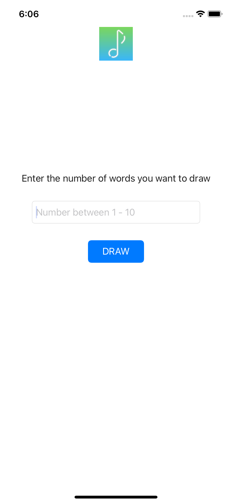
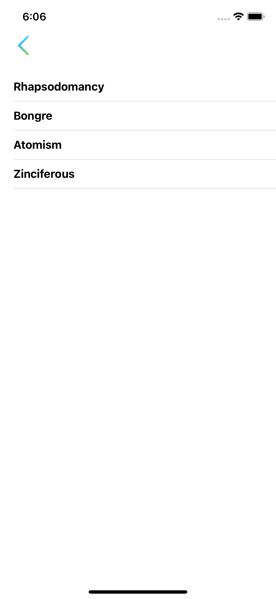
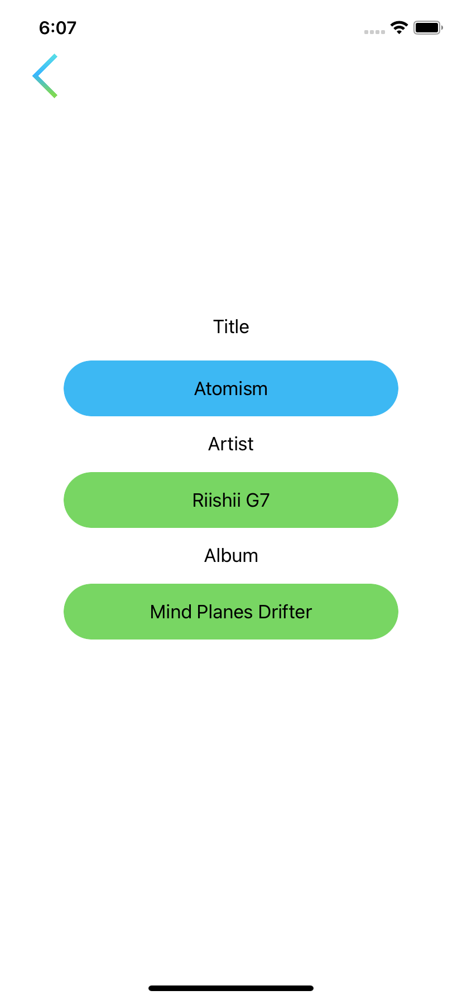

# InternshipApp
Application showing my programming skills, consisting of 3 screens. 

## Contents

- [Information](#Information)
- [Api](#Api)
- [Photo App](#PhotoApp)

## Information
- MVC
- Xib
- Swift 5

## Api
Draw random words with:
https://random-words-api.vercel.app/word
Downloading data with: 
https://musicbrainz.org/ws/2/recording/?query=title:\(title)&fmt=json

I use Codable and URLSession

Data Model:
```json
{
  "recordings": [
    {
      "title": "string",
      "artist-credit": [
        {
         "name": "string"
        }
      ],
      "releases": [
        {
         "title": "string",
        },
      ]
    }
  ]
}
```
## Photo App
[](./img/1.png)
[](./img/2.png)
[](./img/3.png)
